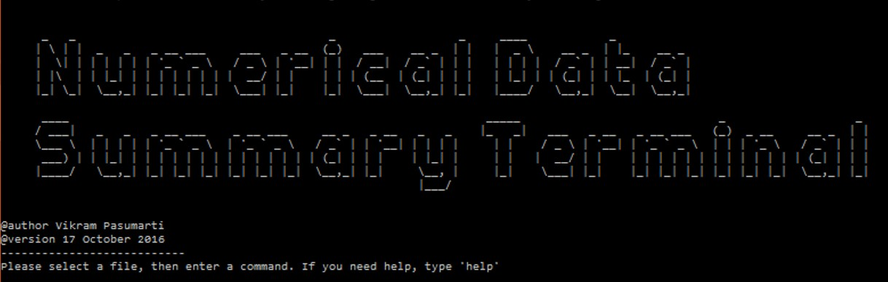

# Numerical Data Summary Terminal

How to Run the Program
--------------------------

- WINDOWS USERS

  1) Download the jar file and the bat file.
  
  2) Place them both in a folder.
  
  3) Double click on the bat file.
  
- MAC and LINUX USERS

  1) Download the jar file.
  
  2) Place it in a folder.
  
  3) Navigate to the folder using your terminal.
  
  4) Type the command java -jar NumericalDataSummaryTerminal.jar

Important
----------
- The file you input should be a text file that contains numbers listed out.

- The program is designed for univariate data sets, so all of the numbers in your inputted text file are considered part of the same variable of the dataset.

- If you start the program with a terminal or command prompt window that is not full screen, the title text gets jumbled. This does not affect the performance of the program, it simply makes the title text look bad.

- If you run the "file" command and you cannot find the file dialog window, minimize your terminal and other windows. It should be underneath.

- The list of numbers in the text files that you select can be punctuated with spaces or commas. However, if you choose to add commas, make sure that there are spaces between the commas and numbers (e.g. 5 , 2 , 8 , 1). If not, the program will not read numbers with commas attached. 

Future Plans
------------

- Make running the program easier for Mac and Linux users

- Graph support, namely histograms and box plots.
